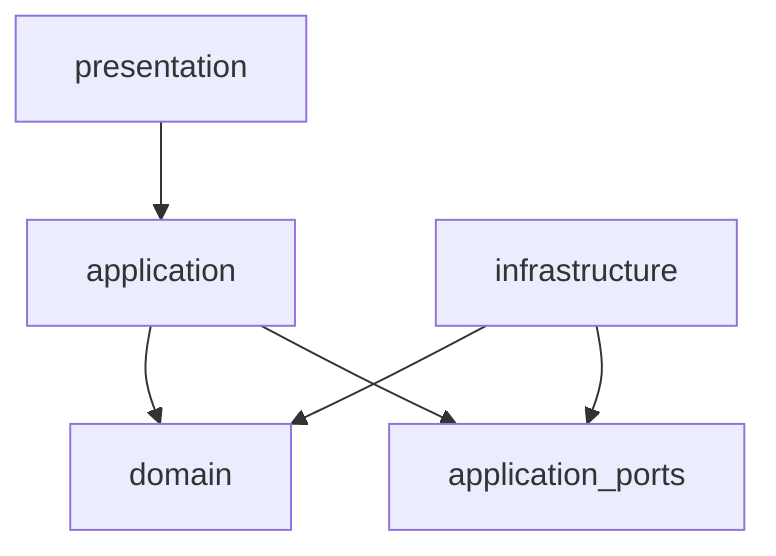
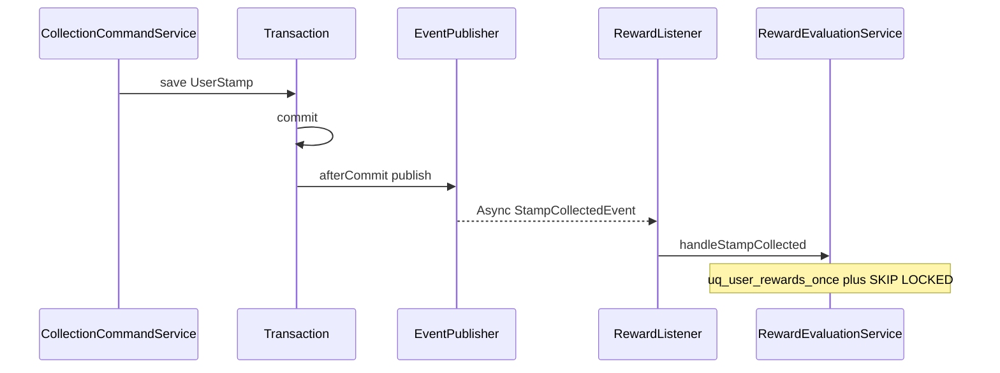

# ARCHITECTURE ALIGNMENT PLAN — ExoticStamp Backend

> Source-grounded audit (2026-07-11). Target: **Spring-pragmatic DDD**.  
> Non-goals: package moves, entity rewrite, monetization feature build, mandatory outbox.

---

## 1. Executive verdict

The codebase **matches** Spring-pragmatic DDD for layer direction in almost all modules. Drift is concentrated in:

1. One hard **domain → application** inversion (`CollectionDomainService`).
2. **Documentation** claiming collection/reward/community are unfinished while they are implemented.
3. **IMPLEMENTATION_GUARDRAILS** describing separate `*Entity` + mapper while adapters pass through JPA-annotated domain models.
4. **ArchUnit** missing `domain → application` and cross-module repository rules.
5. Collection → reward is after-commit + async with DB uniqueness, but **no outbox** — orphan-stamp risk is real and deferred.

**Recommendation:** targeted refactoring + docs sync — **not** docs-only, **not** a major architecture rewrite.

---

## 2. Confirmed architecture model

```text
presentation -> application -> domain
infrastructure -> domain / application ports
```

| Decision | Status |
|----------|--------|
| Spring-pragmatic DDD | Confirmed |
| JPA `@Entity` on `domain/model` | **Allowed** |
| Separate persistence `*Entity` | **Optional**, not mandatory |
| domain ↛ application / presentation / infrastructure | **Hard rule** |
| application ↛ `JpaRepository` | **Hard rule** |
| presentation → application only | **Hard rule** |
| Cross-module via ports / integration events | **Hard rule** (auth→user repo is a known gap) |



---

## 3. Module-by-module inventory

### 3.1 Summary

| Module | Status | Package notes | Cmd/Query | Controllers | Tests (approx) | Violations |
|--------|--------|---------------|-----------|-------------|----------------|------------|
| auth | Implemented | `application/*Service` root | `AuthCommandService`, `AuditLogService` | `AuthController` | ~7 | Cross-module `UserRepository`; `infra.mail` |
| user | Implemented | services at root | `UserCommandService`, `UserQueryService` | `UserController` | ~3 | `User` implements `UserDetails` (pragmatic) |
| rbac | Implemented | services at root; flat infra | Role/Permission Cmd+Query | Role, Permission | ~2 | Soft: `User` in security helper |
| metro | Implemented | services at root | Line/Station/ScanKey Cmd+Query, scan, upload | 7 | ~18 | Soft: `infra.storage` |
| collection | Implemented | `application/service/` | Collection/Campaign/StampDesign Cmd+Query | 7 | ~24 | **P0** `CollectionDomainService` → application |
| reward | Implemented | `application/service/` | Reward/Milestone/Voucher/Eval | 5 | ~13 | None hard |
| community | Implemented | `application/service/` | Referral/Share/Notification | 3 | ~7 | None hard |
| monetization | **Schema only** | empty dir | — | — | 0 | N/A (no Java) |

### 3.2 Layer artifacts (all implemented modules)

| Artifact | Pattern in code |
|----------|-----------------|
| Domain models | `domain/model/*` with `@Entity` (no `domain/entity/`) |
| Domain repositories | Interface only under `domain/repository/` |
| JPA repositories | `Jpa*` under `infrastructure/persistence` or `infrastructure/repository` |
| Adapters | `*RepositoryAdapter` / `*PortAdapter` |
| Ports | `application/port/*` (auth, metro, collection, reward, community, user) |
| Events | Domain events + `@Async` `@EventListener` in infrastructure |
| Exception | `CampaignStationEntity` under collection infra is the rare separate entity |

### 3.3 Package inconsistency (grandfathered)

| Pattern | Modules |
|---------|---------|
| `application/*Service` at root | auth, user, rbac, metro |
| `application/service/*` | collection, reward, community |
| Controllers at `presentation/` root | auth, user, rbac, metro, part of collection |
| Controllers under `presentation/controller/` | reward, community, part of collection |

**Canonical for new modules:** `application/service`, `presentation/controller`, `infrastructure/repository`, `domain/model`.  
**Do not** mass-move grandfathered packages.

---

## 4. Verified violations only

### P0 — layer inversion

| ID | File | Lines | Dependency | Severity | Runtime risk | Correction |
|----|------|-------|------------|----------|--------------|------------|
| V1 | `modules/collection/domain/service/CollectionDomainService.java` | 3, 18–21 | imports `application.support.CollectionPolicyService` | P0 | Low (unused in main; only test wiring) | Delete class + test; use `CollectionPolicyService` directly |

### P1 — enforcement, docs, cross-module

| ID | File | Lines | Dependency | Severity | Runtime risk | Correction |
|----|------|-------|------------|----------|--------------|------------|
| V2 | `ArchitectureBoundaryTest.java` | 25–62 | Missing `domain` ↛ `application` | P1 | Allows regressions | Add ArchUnit rule |
| V3 | `docs/architecture.md` | §4.2 | Stale module status | P1 | Process/docs drift | Update status |
| V4 | `docs/IMPLEMENTATION_GUARDRAILS.md` | §I–IV | Mandates `StationEntity` + mapper | P1 | Wrong mental model | Document pragmatic model |
| V5 | `auth/.../AuthCommandService.java` | 41, 77 | `user.domain.repository.UserRepository` | P1 | Coupling / future boundary breaks | `UserAccountPort` |
| V6 | `auth/.../AuthCommandService.java` | 3, 88 | `infra.mail.MailService` | P1 (soft) | Shared infra OK short-term | Optional mail port later |
| V7 | metro Station/PublicAsset services | — | `infra.storage` | P1 (soft) | Same | Optional storage port later |
| V8 | Collection→reward event path | — | No outbox; publish/listener can drop work | P1 (ops) | Orphan stamp without reward | Metrics + deferred outbox |

### Clean (verified absent)

| Rule | Result |
|------|--------|
| domain → presentation | None |
| domain → `modules/*/infrastructure` | None |
| application → `modules/*/infrastructure` | None |
| application → `JpaRepository` | None |
| presentation → domain | None |
| presentation → infrastructure | None |

---

## 5. False alarms from previous audit

| Claim | Verdict |
|-------|---------|
| JPA on domain models is a violation | **False** under pragmatic target |
| Must split persistence entities now | **False** — optional |
| Must repo-wide rename packages | **False** — grandfather + convention |
| Listener runs before commit on normal path | **Mostly false** — `RbacTransactionCallbacks.afterCommit`; risk only when TX sync inactive |
| All `application.support` policy must move to domain | **False** — classify per rule |
| Outbox required immediately | **Not proven** — defer unless at-least-once reward is required |
| application → module infrastructure | **False** |
| presentation → domain/infrastructure | **False** |

---

## 6. Dependency violation checklist

| Direction | Hits | Notes |
|-----------|------|-------|
| domain → application | **1** | `CollectionDomainService` |
| domain → presentation | 0 | |
| domain → infrastructure | 0 | |
| application → infrastructure impl | 0 (modules) | Shared `infra.*` exists |
| application → JpaRepository | 0 | |
| presentation → domain | 0 | |
| presentation → infrastructure | 0 | |
| Cross-module domain.repository | **1** | auth → `UserRepository` |
| Cross-module domain.model | Several | auth/rbac → `User` (pragmatic; port preferred) |

---

## 7. ArchitectureBoundaryTest

### Currently enforced

1. `domain` ↛ `presentation` / `infrastructure`
2. `application` ↛ `presentation`
3. `application` ↛ types assignable to `JpaRepository`
4. `presentation` ↛ `infrastructure`
5. `presentation` ↛ `domain`

### Important missing rules

1. `domain` ↛ `application` (**must add**)
2. `application` ↛ `..modules..infrastructure..` (already clean; add to lock)
3. Cross-module `domain.repository` imports (add after `UserAccountPort`)

### False-positive risks

- Banning `..infra..` as if it were `infrastructure` would break legitimate shared mail/storage/cache usage unless ports exist.
- Banning JPA annotations on domain would reject the entire pragmatic model.
- Over-broad `dependOnClassesThat().resideInAPackage("..domain..")` from presentation is already correct; do not exclude `common`.

### Exclusions

- **Should not** exclude `CollectionDomainService` — delete it instead.
- Temporary allowlist for auth→`UserRepository` only until Phase 3 port lands; then remove allowlist.

---

## 8. Collection policy placement

Legend: **A** domain invariant · **B** domain policy · **C** application orchestration · **D** infrastructure · **E** presentation validation

### `CollectionPolicyService`

| Method | Class | Action |
|--------|-------|--------|
| `assertCollectAllowed` | **A** | Keep in application; backed by DB unique; do not recreate domain facade |
| `resolveIdempotentReplay` | **B** + **C** | Stay (needs repo + config window) |

### Related helpers

| Helper | Class | Action |
|--------|-------|--------|
| `GpsValidationService.validate` | **B** (+ **E**-adjacent) | Stay in application.support |
| `DefaultCampaignResolver` | **B** + **C** | Stay |
| `StampDesignResolver` | **C** | Stay |
| `CollectionCommandService.validateCommand` | **E** | Stay |
| Audit helpers in policy | **C** / **D** | Stay; do not pull into domain |

**Do not** move the entire `application.support` package into domain. Removing `CollectionDomainService` fixes the inversion without relocating policy.

---

## 9. Collection → reward event flow



| Concern | Finding |
|---------|---------|
| Publication timing | After save; registered via `RbacTransactionCallbacks.afterCommit` |
| Transaction phase | After commit when sync active; **immediate** if sync inactive |
| Async | `@Async` on reward listener |
| Payload coupling | IDs + `CollectMethod`; reward uses `userId` + `campaignId` |
| Retry | In-process max attempts + backoff; then swallow |
| Duplicate reward | `uq_user_rewards_once` + evaluation race handling |
| Voucher concurrency | `FOR UPDATE SKIP LOCKED` |
| Failure after stamp commit | Publish catch / listener exhaust → orphan stamp |
| Crash risk | In-memory Spring events; no durable queue |
| Outbox | **Deferred** — not required now; P2 if product needs at-least-once |

### Mandatory edge cases

1. **Listener before commit:** Normal path safe. Sync-inactive fallback can publish early (`RbacTransactionCallbacks` L18–19).
2. **Retry after partial voucher:** Same TX; `PENDING_STOCK` + `markProcessed` means no auto re-allocate.
3. **Two simultaneous stamps / same milestone:** DB unique + SKIP LOCKED; covered by `RewardConcurrencyIT`.
4. **Indirect infra adapter import:** Not found for `modules/*/infrastructure`.
5. **ArchUnit vs common:** Do not ban `common` / naive `infra`.
6. **Package moves:** Out of scope — breaks scanning/mental model.
7. **Removing `CollectionDomainService`:** Safe — unused in main; only its unit test.
8. **Policy + repository:** May live in application; must not sit in domain importing application.
9. **Lazy outside TX:** Models mostly UUID FKs; low risk.
10. **Docs stronger than tests:** ArchUnit must land with docs claims.

---

## 10. Documentation drift

| Doc | Stale claim | Reality |
|-----|-------------|---------|
| `architecture.md` §4.2 | collection/reward/community unfinished | Implemented |
| `architecture.md` §5 | Flyway V1–V6; V1=mail | V1–V18; V1=identity/RBAC; mail=V7 |
| `IMPLEMENTATION_GUARDRAILS` | `domain/entity` + `StationEntity` | `domain/model` + `@Entity` |
| `EXOTIC_STAMP_CONTEXT` | metro incomplete; foreign `fbnetwork` tree | metro implemented; package `metro.ExoticStamp` |
| `working_pipeline` | monetization as live pipeline | Schema only; no Java |

---

## 11. Test coverage matrix

| Layer | Strength | Gaps |
|-------|----------|------|
| Controller | Strong for metro/auth/collection runtime | Admin partner/reward/voucher, share, stamp design, scan keys, permissions |
| Application service | Strong for collect/reward/auth/metro | — |
| Repository / IT | Collection persistence, reward concurrency, Flyway ITs | Monetization N/A |
| Architecture | Partial ArchUnit | domain→application (to add) |
| Concurrency / idempotency | Reward IT + collect idempotency tests | — |
| Full product flow | Partial (event listener + IT) | No durable end-to-end outbox replay |

---

## 12. P0 / P1 / P2 remediation backlog

### P0

- [x] Documented in this file
- [x] Delete `CollectionDomainService` + test
- [x] Add ArchUnit `domain` ↛ `application`

### P1

- [x] Sync architecture docs to pragmatic model + real module/Flyway status
- [x] Introduce `UserAccountPort`; decouple auth from `UserRepository`
- [x] Lock `application` ↛ module `infrastructure` in ArchUnit
- [x] Document after-commit / orphan-reward ops risk (+ metrics)

### P2

- [ ] Optional mail/storage ports
- [x] Orphan-reward metrics (`reward.stamp_collected.orphan`, `collection.stamp_collected.publish_failed`)
- [x] High-value controller test (`AdminPartnerControllerTest`)
- [ ] Outbox if product requires at-least-once reward
- [ ] Monetization Java module when product prioritizes
- [ ] Optional re-eval admin/job endpoint
---

## 13. Exact files expected to change

| Phase | Files |
|-------|-------|
| 0 | `docs/ARCHITECTURE_ALIGNMENT_PLAN.md` (this file) |
| 1 | Delete `CollectionDomainService.java`, `CollectionDomainServiceTest.java`; edit `ArchitectureBoundaryTest.java` |
| 2 | `architecture.md`, `IMPLEMENTATION_GUARDRAILS.md`, `working_pipeline.md`, `EXOTIC_STAMP_CONTEXT.md` |
| 3 | New user port + adapter; `AuthCommandService.java`; auth tests; ArchUnit cross-module rule |
| 4 | Reward listener metrics; selected controller tests; docs notes |

---

## 14. Non-goals

- Rewrite entities / introduce mandatory `StationEntity`
- Repo-wide package moves
- Implement monetization business code in this workstream
- Mandatory transactional outbox
- Remove `UserDetails` from `User` or Spring from domain events

---

## 15. Data integrity risks

| Risk | Mitigation in code | Residual |
|------|--------------------|----------|
| Duplicate stamp | App check + `uq_user_stamps_collect` | Low |
| Duplicate reward | `uq_user_rewards_once` | Low |
| Voucher double-assign | `FOR UPDATE SKIP LOCKED` | Low |
| Stamp without reward | Event drop / listener failure | **Medium** — ops/manual re-eval |
| `PENDING_STOCK` never filled | Import does not auto-fill | Medium product gap |

---

## 16. Transaction / event consistency risks

- After-commit publish is correct when TX sync is active.
- Sync-inactive path publishes immediately (tests / misconfigured TX).
- Async listener failures after stamp commit are not durable.
- Outbox deferred by product decision.

---

## 17. Security implications

- Phases 0–2: no authz model change.
- Phase 3 port must not widen user field exposure beyond what auth already uses.
- Do not weaken stamp/reward unique constraints.
- Scan-key secrets remain redacted in application support (`ScanKeyRedactor`).

---

## 18. Test plan

| Phase | Tests |
|-------|-------|
| 1 | `ArchitectureBoundaryTest`, `CollectionCommandServiceTest`, reward unit/IT smoke |
| 2 | Docs-only |
| 3 | `AuthCommandServiceTest`, auth controller tests, ArchUnit cross-module |
| 4 | New controller tests; reward metrics assertions if added |

---

## 19. Rollback strategy

| Phase | Rollback |
|-------|----------|
| 1 | Restore deleted class from git (low risk — unused in main) |
| 2 | Revert markdown |
| 3 | Revert port; auth injects `UserRepository` again |
| 4 | Revert metrics/tests independently |

---

## 20. Recommended implementation phases

1. **Phase 0:** This document  
2. **Phase 1:** P0 delete facade + ArchUnit  
3. **Phase 2:** Docs sync  
4. **Phase 3:** `UserAccountPort`  
5. **Phase 4:** Selective hardening (metrics, controller tests)  

---

## 21. Final recommendation

**Targeted refactoring + documentation sync.**

Do **not** choose docs-only (leaves P0 inversion and ArchUnit gap).  
Do **not** choose major rewrite (JPA-on-domain and package layouts are intentional pragmatic choices).
