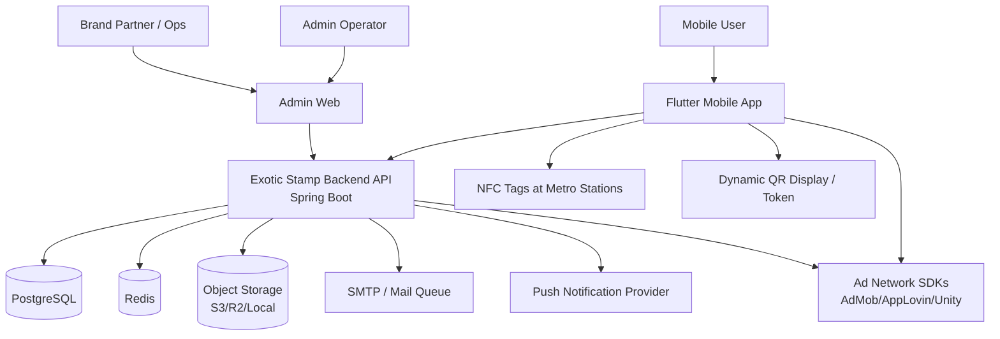
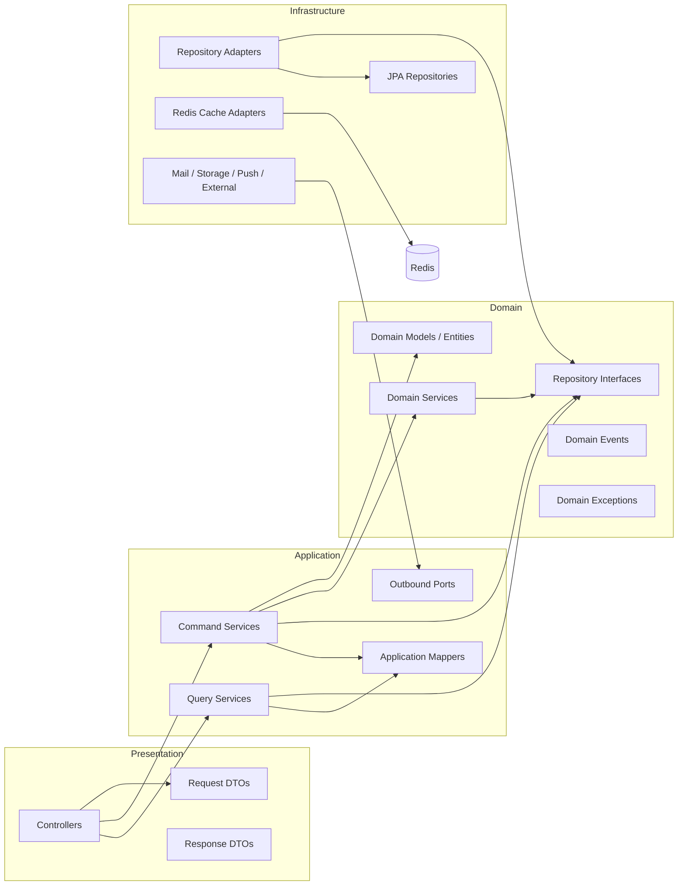
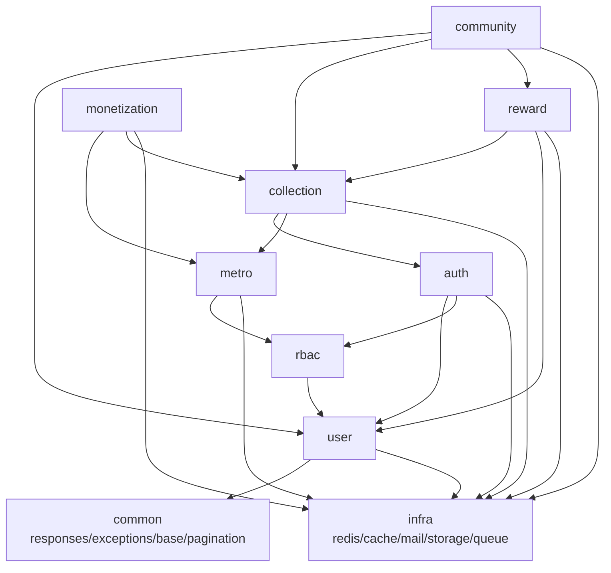
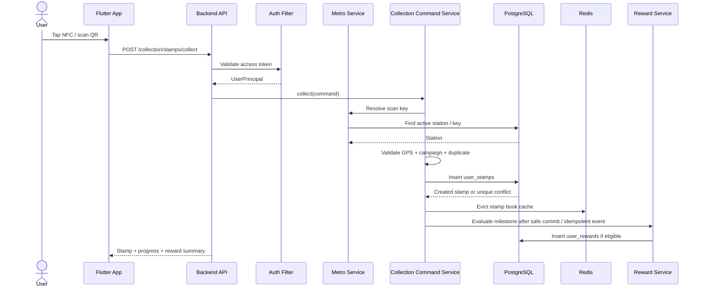
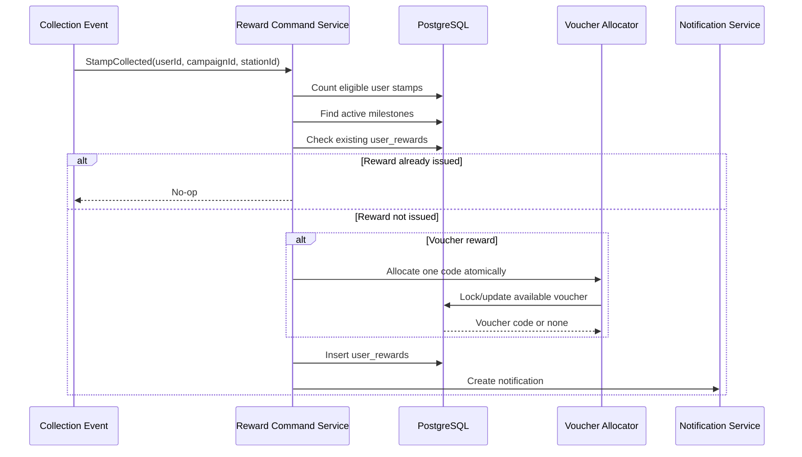
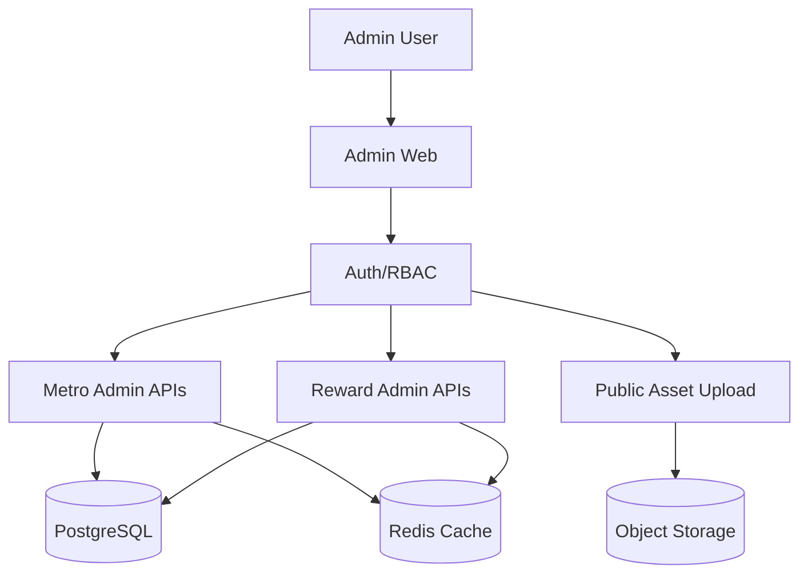
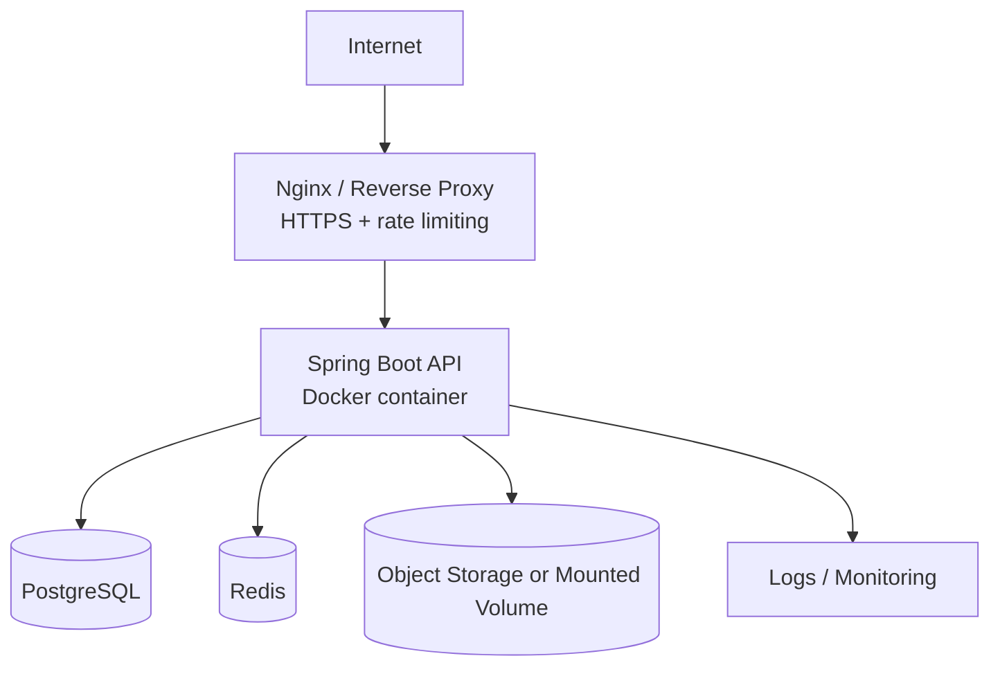

# 10 — Architecture Diagram: Exotic Stamp / Metro Stamp

> Status: Draft v0.1  
> Owner: Backend Lead / Tech Lead  
> Purpose: Provide architecture diagrams and structural rules for the MVP backend, mobile integration, admin operations, and future monetization/community modules.

---

## 1. Feasibility Check

The current architecture direction is feasible for MVP and scale-up if the team preserves module boundaries.

The correct shape is a Spring-pragmatic DDD backend with clear module ownership:

```text
presentation -> application -> domain <- infrastructure
```

This is sustainable for Exotic Stamp because the app has distinct bounded contexts:

- identity and access;
- metro station operations;
- collection and anti-cheat;
- reward and voucher fulfillment;
- monetization events;
- community and growth.

The architecture will fail if controllers become business services, application services import JPA repositories directly, or reward/ads logic is mixed into collection without clear transactional boundaries.

---

## 2. System Context Diagram



---

## 3. Backend Layer Diagram



### Hard rule

Infrastructure can implement domain ports. Domain must not know infrastructure exists.

---

## 4. Module Diagram



### Dependency intent

- `auth`, `user`, `rbac` provide identity/security foundation.
- `metro` provides station and scan-key truth.
- `collection` owns stamp issuance and anti-cheat.
- `reward` reacts to collection and owns milestone/voucher rules.
- `monetization` observes user/ad interactions but must not own collection truth.
- `community` handles share/referral/notifications after the core loop works.

---

## 5. Scan-to-Stamp Sequence Diagram



---

## 6. Reward Issue Sequence Diagram



---

## 7. Admin Operations Diagram



### Admin write rule

Every admin write that affects mobile runtime must invalidate the relevant cache:

- station list;
- station detail;
- scan-key lookup;
- campaign config;
- stamp book public metadata;
- reward/milestone config.

---

## 8. Deployment Architecture — MVP



### MVP deployment rule

Do not expose the Spring Boot port directly to the public internet. Route through reverse proxy with HTTPS and rate limiting.

---

## 9. Package Structure

```text
src/main/java/metro/ExoticStamp/
├── config/
├── common/
├── infra/
└── modules/
    ├── auth/
    ├── user/
    ├── rbac/
    ├── metro/
    ├── collection/
    ├── reward/
    ├── monetization/
    └── community/
```

Each module should follow:

```text
modules/{module}/
├── domain/
├── application/
├── infrastructure/
└── presentation/
```

---

## 10. Data Integrity Rules by Architecture Layer

| Layer | Responsibility | Must Not Do |
|---|---|---|
| Presentation | Validate request shape, auth principal, call application service | Business rules, JPA access, token parsing manually |
| Application | Orchestrate use case, transaction boundary, cache eviction, event publishing | Direct `JpaRepository` usage, HTTP response shaping |
| Domain | Business rule validation, domain model, repository interface | Infrastructure integration, DTO imports |
| Infrastructure | JPA/Redis/storage/mail adapters | Own business decisions |
| Database | Final invariant enforcement | Replace service/domain validation entirely |

---

## 11. Security Architecture

```text
Client Request
↓
Nginx / Gateway controls
↓
Spring Security Filter Chain
↓
JWT validation
↓
Access token revocation check
↓
User principal resolution
↓
@PreAuthorize permission check
↓
Controller
```

### Security non-negotiables

- No public admin endpoints.
- No sensitive fields in DTO response.
- No JWT fallback secret in code.
- No Swagger exposed in production unless explicitly protected.
- Access token revocation policy must be tested.
- File upload must validate type, size, path, and public/private scope.

---

## 12. Scalability Hot Paths

| Hot Path | Risk | Required Design |
|---|---|---|
| Scan key lookup | High read frequency | Indexed lookup + short TTL cache |
| Stamp collection insert | Write race | Unique constraint + transaction handling |
| Stamp book query | Repeated mobile read | Cache-aside + invalidation on collect/admin change |
| Reward issue | Duplicate async event | Idempotent insert + unique reward constraint |
| Impression ingest | High write volume | Append-only table + batch aggregation |
| Affiliate click ingest | Fraud / volume | Append-only + anti-spam/rate-limit |

---

## 13. Edge Cases / Failure Modes

1. **Controller bypasses application service**  
   Leads to untracked writes, missing cache invalidation, missing audit logs.

2. **Application imports JPA repository directly**  
   Breaks dependency rule and makes module testing brittle.

3. **Reward listener runs before stamp transaction commit**  
   Reward count may not see the latest stamp. Use transaction-aware event handling or idempotent retry.

4. **Redis unavailable during scan**  
   QR token validation and cache may fail. Define fail-open/fail-safe separately for cache versus security tokens.

5. **Public asset upload stores executable content**  
   File upload must restrict MIME, extension, size, and storage path.

6. **Ad impression endpoint becomes a write amplifier**  
   Needs rate limiting, payload validation, and later batch ingestion strategy.

---

## 14. Architecture Acceptance Gate

This document is accepted only when:

- every module follows `presentation -> application -> domain <- infrastructure`;
- write paths are transactionally owned by command services;
- read paths use query services with `readOnly=true` when appropriate;
- infrastructure adapters implement ports/repository interfaces;
- hot paths have DB indexes and cache policy;
- no MVP feature depends on Phase 2 monetization/community modules;
- deployment does not expose backend directly without reverse proxy/security controls.
