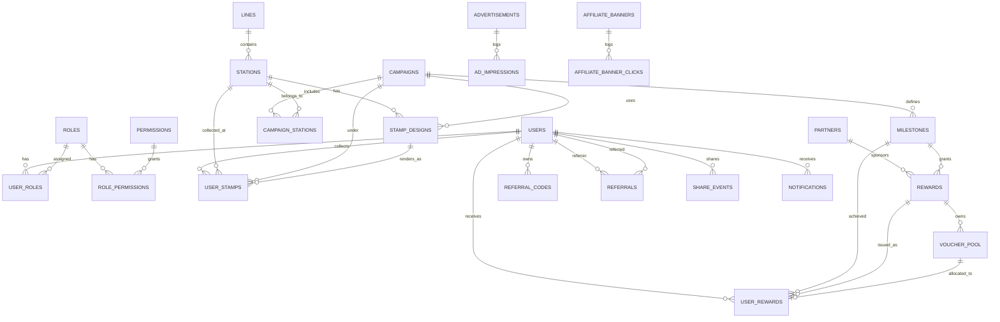

# 11 — ERD: Exotic Stamp / Metro Stamp

> Status: Draft v0.1  
> Owner: Backend Lead / Database Owner  
> Purpose: Define the data model, relationships, invariants, indexes, and data integrity rules for MVP and near-future modules.

---

## 1. Feasibility Check

The ERD is feasible for MVP if the database is treated as the final authority for business invariants.

Service-level validation is not enough. Exotic Stamp has several race-sensitive flows:

- duplicate scan;
- reward issue after milestone;
- voucher allocation;
- scan-key rotation;
- ad impression ingestion;
- referral uniqueness.

These must be enforced by a combination of:

```text
request validation
+ domain validation
+ transaction boundary
+ database constraints
+ indexes
+ idempotency strategy
```

---

## 2. Domain Areas

```text
Identity & Access
├── users
├── roles
├── permissions
├── user_roles
└── role_permissions

Metro
├── lines
├── stations
└── station scan-key fields / related key table depending implementation

Collection
├── campaigns
├── campaign_stations
├── stamp_designs
└── user_stamps

Reward
├── partners
├── milestones
├── rewards
├── voucher_pool
└── user_rewards

Monetization
├── advertisements
├── ad_impressions
├── affiliate_banners
└── affiliate_banner_clicks

Community
├── referral_codes
├── referrals
├── share_events
└── notifications
```

---

## 3. MVP ERD — Mermaid



---

## 4. Table Specification — Identity & Access

### 4.1 `users`

| Column | Type | Required | Notes |
|---|---|---:|---|
| `id` | UUID | Yes | Primary key. |
| `email` | varchar | Yes | Unique, normalized lowercase. |
| `username` | varchar | Conditional | Unique if supported. |
| `password_hash` | varchar | Yes | Never exposed. |
| `status` | enum/string | Yes | Active, pending, disabled, etc. |
| `token_version` | bigint/int | Yes | Used for access token invalidation. |
| `created_at`, `updated_at` | timestamp | Yes | Base entity. |

#### Invariants

- Email must be unique.
- Password hash must never leave persistence/application boundary.
- Token version must increment on logout-all/password reset/reuse attack policy.

---

### 4.2 `roles`, `permissions`, `user_roles`, `role_permissions`

#### Invariants

- Role names are unique.
- Permission names are unique.
- `(user_id, role_id)` is unique.
- `(role_id, permission_id)` is unique.

---

## 5. Table Specification — Metro

### 5.1 `lines`

| Column | Type | Required | Notes |
|---|---|---:|---|
| `id` | UUID | Yes | Primary key. |
| `code` | varchar | Yes | Unique line code. |
| `name` | varchar | Yes | Display name. |
| `status` | enum/string | Yes | Draft/active/inactive/archived depending implementation. |
| `sort_order` | int | Yes | App ordering. |

#### Invariants

- `code` must be unique.
- Inactive line must not be available for new public collection unless explicitly allowed.

---

### 5.2 `stations`

| Column | Type | Required | Notes |
|---|---|---:|---|
| `id` | UUID | Yes | Primary key. |
| `line_id` | UUID | Yes | FK to `lines`. |
| `code` | varchar | Yes | Unique per line. |
| `name` | varchar | Yes | Display name. |
| `description` | text | No | Public content. |
| `latitude` | decimal | Yes | GPS validation. |
| `longitude` | decimal | Yes | GPS validation. |
| `gps_radius_meters` | int | Yes | Station-specific radius. |
| `status` | enum/string | Yes | Active/inactive/maintenance/draft. |
| `nfc_tag_id_hash` | varchar | Conditional | Hashed NFC key recommended. |
| `qr_station_code` | varchar | Conditional | Stable station QR source if using dynamic token service. |
| `stamp_image_url` | varchar | No | Public asset. |

#### Invariants

- `(line_id, code)` must be unique.
- Active station must have valid latitude/longitude.
- GPS radius must be positive and bounded.
- Active station must have at least one enabled scan method if collection is allowed.

#### Recommended indexes

```sql
idx_stations_line_id
idx_stations_status
idx_stations_nfc_tag_id_hash
idx_stations_qr_station_code
uq_stations_line_code(line_id, code)
```

---

## 6. Table Specification — Collection

### 6.1 `campaigns`

| Column | Type | Required | Notes |
|---|---|---:|---|
| `id` | UUID | Yes | Primary key. |
| `code` | varchar | Yes | Unique campaign code. |
| `name` | varchar | Yes | Display name. |
| `type` | enum/string | Yes | Default/seasonal/event. |
| `status` | enum/string | Yes | Draft/active/paused/ended. |
| `start_at` | timestamp | Conditional | Required for scheduled campaigns. |
| `end_at` | timestamp | Conditional | Required for scheduled campaigns. |
| `is_default` | boolean | Yes | MVP likely uses one default active campaign. |

#### Invariants

- Only one default active campaign unless multi-campaign is explicitly implemented.
- `start_at < end_at` if both exist.
- Collection must reject inactive/expired campaign.

---

### 6.2 `campaign_stations`

Join table defining which stations are eligible for a campaign.

#### Invariants

- `(campaign_id, station_id)` must be unique.
- Inactive station should not be enabled for active collection unless explicitly allowed.

---

### 6.3 `stamp_designs`

| Column | Type | Required | Notes |
|---|---|---:|---|
| `id` | UUID | Yes | Primary key. |
| `station_id` | UUID | Yes | FK to station. |
| `campaign_id` | UUID | Yes | FK to campaign. |
| `image_url` | varchar | Yes | Stamp asset. |
| `status` | enum/string | Yes | Active/inactive. |

#### Invariants

- One active design per `(station_id, campaign_id)` unless design versioning is explicitly supported.

---

### 6.4 `user_stamps`

| Column | Type | Required | Notes |
|---|---|---:|---|
| `id` | UUID | Yes | Primary key. |
| `user_id` | UUID | Yes | User UUID. |
| `station_id` | UUID | Yes | FK to station. |
| `campaign_id` | UUID | Yes | FK to campaign. |
| `stamp_design_id` | UUID | Yes | FK to design. |
| `scan_type` | enum/string | Yes | NFC/QR/manual-admin if supported. |
| `scan_key_fingerprint` | varchar | Yes | Do not store raw secret. |
| `gps_latitude` | decimal | Yes | User-submitted GPS captured for audit. |
| `gps_longitude` | decimal | Yes | User-submitted GPS captured for audit. |
| `gps_accuracy_meters` | decimal | Conditional | Required from mobile if available. |
| `distance_to_station_meters` | decimal | Yes | Server-calculated. |
| `device_fingerprint_hash` | varchar | Conditional | Anti-abuse. |
| `idempotency_key` | varchar | Recommended | Retry safety. |
| `collected_at` | timestamp | Yes | Server time. |

#### Invariants

- MVP default: user can collect a station once per campaign.
- DB must enforce uniqueness.
- Client timestamp is not authoritative.
- Raw NFC/QR secret should not be stored if avoidable.

#### Required constraints/indexes

```sql
uq_user_station_campaign(user_id, station_id, campaign_id)
uq_user_stamp_idempotency(user_id, idempotency_key) -- if idempotency key is implemented
idx_user_stamps_user_campaign(user_id, campaign_id)
idx_user_stamps_station_created(station_id, collected_at)
idx_user_stamps_created_at(collected_at)
```

---

## 7. Table Specification — Reward

### 7.1 `partners`

Brand or internal partner providing rewards.

#### Invariants

- Partner code/name must be unique enough for operations.
- Inactive partner must not be used for new active rewards.

---

### 7.2 `milestones`

| Column | Type | Required | Notes |
|---|---|---:|---|
| `id` | UUID | Yes | Primary key. |
| `campaign_id` | UUID | Yes | FK campaign. |
| `stamps_required` | int | Yes | Example: 3, 7, 14. |
| `status` | enum/string | Yes | Active/inactive. |

#### Invariants

- `stamps_required > 0`.
- `(campaign_id, stamps_required)` should be unique for active milestone unless multiple reward choices are supported.

---

### 7.3 `rewards`

| Column | Type | Required | Notes |
|---|---|---:|---|
| `id` | UUID | Yes | Primary key. |
| `milestone_id` | UUID | Yes | FK milestone. |
| `partner_id` | UUID | Conditional | Required for partner reward. |
| `reward_type` | enum/string | Yes | Sticker/voucher/badge/etc. |
| `status` | enum/string | Yes | Active/inactive. |

#### Invariants

- Active milestone should map to at least one active reward if reward issuance is expected.

---

### 7.4 `voucher_pool`

| Column | Type | Required | Notes |
|---|---|---:|---|
| `id` | UUID | Yes | Primary key. |
| `reward_id` | UUID | Yes | FK reward. |
| `code_encrypted` | varchar/text | Yes | Avoid plaintext where possible. |
| `status` | enum/string | Yes | Available/reserved/issued/redeemed/expired. |
| `allocated_to_user_reward_id` | UUID | No | FK user reward. |
| `expires_at` | timestamp | Conditional | Expiry rule. |

#### Invariants

- One voucher code must not be assigned to two user rewards.
- Allocation must be atomic.
- Expired voucher must not be issued.

---

### 7.5 `user_rewards`

| Column | Type | Required | Notes |
|---|---|---:|---|
| `id` | UUID | Yes | Primary key. |
| `user_id` | UUID | Yes | User UUID. |
| `milestone_id` | UUID | Yes | FK milestone. |
| `reward_id` | UUID | Yes | FK reward. |
| `voucher_pool_id` | UUID | Conditional | FK if voucher reward. |
| `status` | enum/string | Yes | Issued/pending/redeemed/expired/failed. |
| `issued_at` | timestamp | Yes | Server time. |

#### Required constraints/indexes

```sql
uq_user_milestone(user_id, milestone_id)
uq_user_reward_voucher(voucher_pool_id) -- if voucher_pool_id not null
idx_user_rewards_user(user_id)
idx_user_rewards_status(status)
```

---

## 8. Table Specification — Monetization

### 8.1 `advertisements`

Ad creative and placement config.

#### Recommended fields

- `id`
- `partner_id`
- `placement`: `PRE_STAMP`, `STAMP_BOOK_NATIVE`, `HOME_BANNER`, etc.
- `creative_url`
- `target_url`
- `status`
- `start_at`, `end_at`
- `priority`, `weight`

#### Invariants

- Expired/inactive creative cannot be served.
- Client cannot decide price, partner, or revenue metadata.

---

### 8.2 `ad_impressions`

Append-only event table.

#### Recommended fields

- `id`
- `advertisement_id`
- `user_id`
- `station_id`
- `campaign_id`
- `placement`
- `event_time`
- `request_id`
- `device_fingerprint_hash`
- `ip_hash`

#### Required indexes

```sql
idx_ad_impressions_ad_time(advertisement_id, event_time)
idx_ad_impressions_user_time(user_id, event_time)
idx_ad_impressions_station_time(station_id, event_time)
```

---

### 8.3 `affiliate_banners`, `affiliate_banner_clicks`

Used for later Phase 2/3 partner traffic.

#### Invariants

- Click must reference active banner or be stored as invalid/fraud-suspect.
- Repeated clicks need rate-limit or dedup window.

---

## 9. Table Specification — Community

### 9.1 `referral_codes`

#### Invariants

- Referral code must be unique.
- One user should have one primary active referral code unless campaign-specific codes are added.

---

### 9.2 `referrals`

#### Invariants

- One referred user can only be referred once.
- User cannot refer themselves.
- Referral completion should be event-driven and idempotent.

---

### 9.3 `share_events`

Append-only table for social sharing actions.

#### Invariants

- Share event is not proof that a social post exists externally unless platform callback exists.
- Do not overtrust client-reported platform or audience data.

---

### 9.4 `notifications`

User-facing notification inbox.

#### Invariants

- Notification payload must not expose secrets or full voucher code unless intended.
- Mark-read operation must be scoped by authenticated user.

---

## 10. Data Integrity Rules

| Rule | Enforcement |
|---|---|
| Duplicate stamp forbidden | Unique `(user_id, station_id, campaign_id)` + idempotency behavior. |
| Duplicate reward forbidden | Unique `(user_id, milestone_id)`. |
| Duplicate voucher allocation forbidden | Unique voucher assignment + atomic allocation. |
| Inactive station cannot be collected | Service validation + status constraint. |
| Expired campaign cannot be collected | Service validation + campaign status/time. |
| QR token one-time use | Redis atomic consume + TTL. |
| Ad impression cannot carry trusted financial values from client | Server-side creative lookup only. |
| Referral self-abuse blocked | Service validation + unique referred user. |

---

## 11. Migration Governance

Every schema change must be done through Flyway.

Rules:

1. No manual production DB edits.
2. No destructive migration without rollback/backfill plan.
3. Add indexes before launching high-volume endpoints.
4. Add constraints at DB level for all business invariants.
5. For large tables, evaluate lock time and deploy strategy.

---

## 12. Edge Cases / Failure Modes

1. **Null campaign in uniqueness constraint**  
   If campaign can be null, normal unique constraint may allow duplicate rows depending DB behavior. MVP should avoid nullable `campaign_id` for `user_stamps`.

2. **Voucher code stored in plaintext**  
   A DB leak exposes all partner vouchers. Encrypt or at least restrict access and audit reads.

3. **Deleting station with existing stamps**  
   Hard delete destroys history. Use status/soft delete for operational entities.

4. **Changing station coordinates after collection**  
   Historical `distance_to_station_meters` should remain on `user_stamps` for audit.

5. **Reward milestone changed after users already collected**  
   Re-evaluation can issue unexpected rewards. Milestone changes need versioning or clear policy.

6. **High-volume ad table grows too quickly**  
   Need time-based indexes and later partitioning/archive plan.

---

## 13. ERD Acceptance Gate

This ERD is accepted only when:

- all P0 tables have primary keys, FK strategy, timestamps, and status fields;
- scan, reward, voucher, and referral uniqueness are DB-enforced;
- hot-path queries have indexes;
- nullable columns do not undermine uniqueness;
- deletion policy is clear for operational entities;
- voucher storage policy is approved;
- migration names and ordering match the actual codebase.
